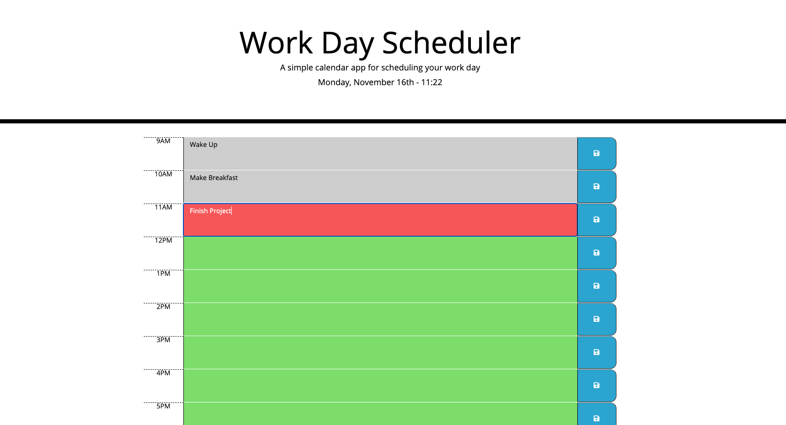

# Work Day Scheduler 

## Purpose
The purpose of this wesbite is to help with your busy day-to-day schedule. From 9-5, you are able to add a task and save it. When it reaches every hour, the task you have at that hour turns red to notify you that you have a task that needs to be done. The rest of the hours after are  green to tell you that you still have things to do. As for past hours, they turn gray meaning that they have passed. 

## Tools 
The tools used to build this wonderful site are listed below: 
    * HTML
    * JavaScript
    * moment.js
    * jQuery
    * Bootstrap

## Website 
When loading the page, this is what you should be greeted with:  

## Live Deployment
To visit the site, click [here.](https://veroli-mart.github.io/work-schedule/)